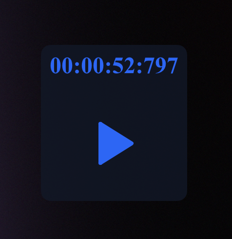
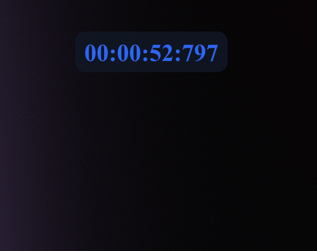

# Floating Stopwatch

## About

This is a super simple Stop Watch app which floats over other apps.

It's a Electron app, which is super easy to install, or configure.

- Edit the `variables.css` file to change the colors
- Run it with `yarn start` or `npm run start`
- Build it with `yarn pkg:mac` or `npm run pkg:mac`
- `cmd + x` - will rest timer
- `Space bar` - will start / stop the timer
- When changing to another window the start/stop button will be hidden and window will automatically collapse

## Screenshots

## License

MIT
